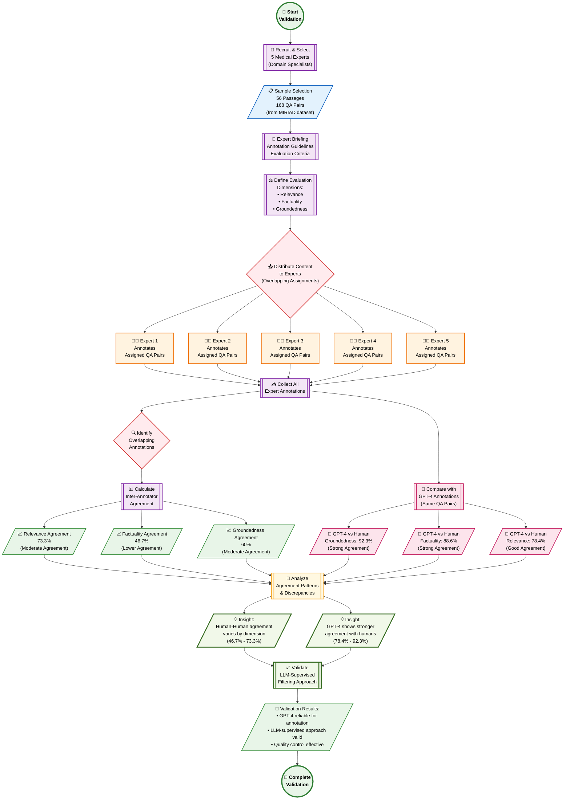

# Human Expert Evaluation: Detailed Methodology & Results

## 🔬 Introduction

Human expert evaluation represents the **final validation step** in the MIRIAD dataset creation pipeline. This rigorous assessment involved recruiting medical domain specialists to evaluate the quality of generated question-answer pairs, providing crucial validation for the LLM-supervised filtering approach. The evaluation serves both as a quality assurance measure and as empirical evidence for the effectiveness of automated content curation in medical domains.

## 🎯 Evaluation Objectives

The human expert evaluation was designed to:

- **Validate LLM-Supervised Approach**: Confirm that GPT-4 can reliably assess medical content quality
- **Measure Inter-Annotator Agreement**: Understand the inherent variability in human medical expert judgments  
- **Assess Multi-Dimensional Quality**: Evaluate groundedness, factuality, and relevance across medical specialties
- **Establish Quality Baselines**: Provide quantitative benchmarks for dataset quality assessment

## 👥 Expert Recruitment & Selection

### Expert Qualifications
- **Domain Expertise**: All evaluators possess advanced medical degrees and clinical experience
- **Specialty Coverage**: Experts represent diverse medical disciplines to ensure broad domain coverage
- **Annotation Experience**: Previous experience with medical content evaluation and research
- **Time Commitment**: Availability for thorough evaluation of assigned content samples

### Selection Criteria
5 medical experts were carefully selected based on:
- **Academic Credentials**: Advanced degrees in medical specialties
- **Clinical Practice**: Active or recent clinical experience
- **Research Background**: Experience with medical literature and evidence evaluation
- **Availability**: Commitment to complete comprehensive evaluation within timeline

## 📊 Evaluation Methodology

### Content Sampling Strategy
- **Representative Sample**: 56 passages selected to represent diverse medical domains
- **QA Pair Selection**: 168 question-answer pairs derived from the sample passages
- **Overlap Design**: Strategic overlap in assignments to enable inter-annotator agreement calculation
- **Balanced Coverage**: Content spans multiple medical specialties and publication years

### Evaluation Dimensions

#### 1. **Groundedness** (92.3% GPT-4 vs Human Agreement)
- **Definition**: Whether the answer is fully supported by the provided medical passage
- **Assessment**: Evaluators verify that all claims in answers can be traced to passage content
- **Significance**: Critical for ensuring answers don't introduce unsupported medical claims

#### 2. **Factuality** (88.6% GPT-4 vs Human Agreement)  
- **Definition**: Medical accuracy and correctness of the information presented
- **Assessment**: Experts evaluate whether statements align with established medical knowledge
- **Significance**: Essential for preventing misinformation in medical AI applications

#### 3. **Relevance** (78.4% GPT-4 vs Human Agreement)
- **Definition**: Whether the question-answer pair addresses clinically meaningful information
- **Assessment**: Evaluation of practical utility and medical significance
- **Significance**: Ensures dataset focuses on medically important content rather than trivial details

## 📈 Key Findings & Results

### Inter-Annotator Agreement Analysis

**Human-to-Human Agreement Rates:**
- **Relevance**: 73.3% (moderate agreement)
- **Groundedness**: 60% (moderate agreement)  
- **Factuality**: 46.7% (lower agreement)

**Interpretation**: The variation in human agreement reflects the inherent subjectivity in medical content evaluation, particularly for factuality assessment where experts may have different perspectives on clinical nuances.

### GPT-4 vs Human Agreement Analysis

**GPT-4 to Human Agreement Rates:**
- **Groundedness**: 92.3% (strong agreement)
- **Factuality**: 88.6% (strong agreement)
- **Relevance**: 78.4% (good agreement)

**Critical Insight**: GPT-4 demonstrates **higher consistency** with individual human experts than humans show with each other, suggesting that LLM-based evaluation may actually be more reliable for large-scale content curation.

## 💡 Validation Insights

### 1. **LLM-Supervised Filtering Effectiveness**
The results provide strong empirical evidence that:
- GPT-4 can reliably identify high-quality medical content
- Automated filtering achieves consistency levels exceeding human-to-human agreement
- LLM-supervised approaches are viable for large-scale medical dataset curation

### 2. **Human Evaluation Variability**
The study reveals important insights about human expert evaluation:
- Medical experts show significant variability in content assessment (46.7%-73.3% agreement)
- Subjective dimensions like "relevance" show higher human agreement than objective measures like "factuality"
- Expert background and specialty may influence evaluation perspectives

### 3. **Scalability Implications**
The findings support the scalability of LLM-supervised approaches:
- Human evaluation is resource-intensive and shows inherent variability
- GPT-4 provides more consistent evaluation at scale
- Hybrid approaches combining LLM filtering with selective human validation offer optimal efficiency

## 🏆 Methodological Contributions

### To Medical AI Research
1. **Validation Framework**: Establishes methodology for evaluating medical QA datasets
2. **Quality Metrics**: Provides standardized dimensions for medical content assessment
3. **Agreement Benchmarks**: Offers baseline agreement rates for future comparative studies

### To Dataset Curation
1. **LLM-Supervised Validation**: Demonstrates effectiveness of automated quality control
2. **Expert Sampling Strategy**: Shows that representative sampling can validate large datasets
3. **Multi-Dimensional Assessment**: Proves importance of evaluating multiple quality aspects

## 🎯 Impact on MIRIAD Quality

The human expert evaluation provides crucial validation that:
- **Quality Standards**: The dataset meets high medical accuracy standards
- **Filtering Effectiveness**: LLM-based filtering successfully identifies high-quality content  
- **Reliability**: The automated approach produces consistently reliable results
- **Clinical Utility**: The content addresses medically relevant and important topics

---

## 👥 Comprehensive Human Evaluation Workflow

The following flowchart details the complete human expert evaluation process, from expert recruitment through final validation of the LLM-supervised filtering approach:

