# Overview of MIRIAD

## 🔬 Introduction

The **MIRIAD** (Medical Information Retrieval with Intelligent Answer Discovery) dataset represents a groundbreaking effort in creating a large-scale, high-quality medical question-answering dataset. This overview provides a comprehensive view of the entire dataset creation pipeline, from initial data collection through final validation.

## 🎯 Project Goals

MIRIAD was designed to address critical gaps in medical AI training data by:

- **Scale**: Creating one of the largest medical QA datasets with 4.4M+ high-confidence question-answer pairs
- **Quality**: Implementing rigorous filtering and validation to ensure factual accuracy and medical relevance  
- **Diversity**: Covering 56 medical disciplines from 800K+ research papers spanning 1970-2021
- **Reliability**: Using both automated LLM-based filtering and human expert validation

## 📊 Dataset Creation Methodology

### Phase 1: Dataset Generation
The creation process begins with the **Semantic Scholar Open Research Corpus (S2ORC)**, a comprehensive collection of academic papers. From this massive corpus:

1. **Medical Paper Filtering**: 2.5M papers tagged as 'Medicine' are identified from the broader corpus
2. **Processing Selection**: 894K papers are selected for LLM processing based on quality criteria
3. **Article Segmentation**: Papers are broken down into manageable passages (≤1,000 tokens each) with sophisticated filtering
4. **QA Generation**: GPT-3.5-Turbo generates question-answer pairs using structured prompts, producing 10.6M raw QA pairs

### Phase 2: Quality Control
Raw QA pairs undergo extensive filtering to ensure high quality:

1. **Rule-based Filtering**: ~5M low-utility pairs are removed (e.g., those containing only passage references)
2. **LLM-based Classification**: A fine-tuned Mistral-7B classifier is trained on GPT-4 annotations to assess factual correctness and domain relevance
3. **High-Confidence Selection**: The classifier identifies 4.4M high-confidence QA pairs while discarding ~400K questionable examples

### Phase 3: Human Validation
The methodology is validated through expert human evaluation:

1. **Expert Recruitment**: 5 medical domain specialists evaluate a representative sample
2. **Multi-dimensional Assessment**: Evaluation across groundedness, factuality, and relevance
3. **Agreement Analysis**: Comparison between human-human and GPT-4-human agreement rates

## 🏆 Key Achievements

- **4,487,542** high-confidence QA pairs from medical literature
- **92.3%** agreement between GPT-4 and human experts on groundedness
- **88.6%** agreement on factuality assessment  
- **78.4%** agreement on relevance evaluation
- **56** medical disciplines represented in the dataset
- **98.4%** of content from modern medical literature (1970-2021)

## 💡 Innovation Highlights

1. **LLM-Supervised Approach**: Demonstrates that GPT-4 can reliably identify high-quality medical content, often with better consistency than human annotators
2. **Sophisticated Filtering**: Multi-stage quality control combining rule-based, LLM-based, and human validation
3. **Balanced Scope**: Covers diverse medical specialties while maintaining factual accuracy
4. **Scalable Methodology**: Provides a replicable framework for creating large-scale domain-specific QA datasets

---

## 📈 Complete MIRIAD Pipeline Flowchart

The following flowchart visualizes the entire MIRIAD creation process, showing how raw medical literature is transformed into a high-quality, validated QA dataset:

```mermaid
flowchart TD
    %% Dataset Generation Phase
    A["🔬 Semantic Scholar<br/>Open Research Corpus<br/>#40;S2ORC#41;"] --> B["🏥 Filter for<br/>'Medicine' Tagged<br/>Articles"]
    B --> C["📊 2,503,836<br/>Medical Papers<br/>#40;Initial Pool#41;"]
    C --> D["📝 Select for<br/>LLM Processing<br/>894,352 Papers"]
    D --> E["✂️ Article Segmentation<br/>≤1,000 tokens per passage<br/>Exclude sentences >400 tokens<br/>#40;67% noise in 500-600 range#41;"]
    E --> F["📋 3,560,470<br/>Prepared Passages"]
    F --> G["🤖 GPT-3.5-Turbo<br/>QA Generation<br/>Structured Prompts"]
    G --> H["💾 10,677,724<br/>Raw QA Pairs<br/>#40;Initial Generation#41;"]
    
    %% Quality Control Phase
    H --> I["🔍 Rule-based Filtering<br/>Remove ~5M low-utility pairs<br/>#40;passage references#41;"]
    I --> J["✅ MIRIAD-5.8M<br/>5,821,948 QA Pairs<br/>2,303,282 passages<br/>812,384 papers"]
    
    %% LLM-based Quality Control
    J --> K["🎯 Sample 15,000<br/>QA Pairs for<br/>GPT-4 Annotation"]
    K --> L["🤖 GPT-4 Assessment<br/>Factual Correctness<br/>& Domain Relevance"]
    L --> M["⚙️ Fine-tune<br/>Mistral-7B Classifier<br/>81.8% recall, 69.7% precision"]
    M --> N["🔬 Apply Classifier<br/>to Full Dataset"]
    N --> O["⭐ MIRIAD-4.4M<br/>4,487,542 High-Confidence<br/>QA Pairs<br/>#40;~400k examples discarded#41;"]
    
    %% Human Expert Validation
    O --> P["👥 Human Expert Review<br/>5 Medical Experts<br/>56 passages, 168 QA pairs"]
    P --> Q["📈 Validation Results<br/>92.3% groundedness agreement<br/>88.6% factuality agreement<br/>78.4% relevance agreement"]
    
    %% Final Dataset
    J --> R["🎯 Final MIRIAD Dataset<br/>56 Medical Disciplines<br/>98.4% from 1970-2021<br/>Questions: 15-20 words<br/>Answers: 60-80 words"]
    O --> R
    Q --> R
    
    %% Styling optimized for high-DPI export
    classDef startNode fill:#e1f5fe,stroke:#01579b,stroke-width:4px,color:#000,font-size:12px,font-weight:bold
    classDef filterNode fill:#f3e5f5,stroke:#4a148c,stroke-width:3px,color:#000,font-size:11px
    classDef dataNode fill:#e8f5e8,stroke:#1b5e20,stroke-width:3px,color:#000,font-size:11px
    classDef processNode fill:#fff8e1,stroke:#f57f17,stroke-width:3px,color:#000,font-size:11px
    classDef qualityNode fill:#fce4ec,stroke:#880e4f,stroke-width:3px,color:#000,font-size:11px
    classDef finalNode fill:#fff3e0,stroke:#e65100,stroke-width:4px,color:#000,font-size:12px,font-weight:bold
    classDef humanNode fill:#f1f8e9,stroke:#33691e,stroke-width:3px,color:#000,font-size:11px
    
    class A startNode
    class B,I filterNode
    class C,D,F,H,J,O dataNode
    class E,G,K,L,M,N processNode
    class I,K,L,M,N,P qualityNode
    class R finalNode
    class P,Q humanNode
```

