# Segmentation: Details

## 🔬 Introduction

Article segmentation is a **critical preprocessing step** in the MIRIAD dataset creation pipeline. This process transforms raw medical research papers into clean, manageable passages optimized for question-answer generation. The segmentation strategy balances computational efficiency with content quality, ensuring that each resulting passage contains coherent, meaningful medical information.

## 🎯 Segmentation Objectives

The segmentation process aims to:

- **Optimal Passage Length**: Create passages of ≤1,000 tokens for efficient LLM processing
- **Content Coherence**: Maintain semantic integrity by preserving complete sentences
- **Quality Control**: Filter out noisy, irrelevant, or problematic content
- **Scalability**: Process 894K medical papers efficiently and consistently

## 📊 Methodology Overview

### Core Segmentation Strategy

The segmentation process uses **tiktoken** tokenization (the same tokenizer used by GPT models) to ensure consistency with downstream LLM processing. The strategy involves:

1. **Sentence-Level Processing**: Articles are split into complete sentences using punctuation-based parsing
2. **Token-Aware Accumulation**: Sentences are accumulated into passages until the 1,000-token limit is approached
3. **Boundary Respect**: Passages are completed at sentence boundaries to maintain coherence
4. **Quality Filtering**: Individual sentences undergo length-based filtering to remove problematic content

### Token Length Analysis & Filtering

Through empirical analysis of medical literature, specific token length ranges were identified as problematic:

- **200-300 tokens**: 15% irrelevant content risk (acceptable)
- **300-400 tokens**: 35% irrelevant content risk (moderate, but acceptable)
- **400-500 tokens**: 48% irrelevant content risk (approaching exclusion threshold)
- **500-600 tokens**: **67% irrelevant content risk** (high noise, excluded)
- **>400 tokens**: Systematic exclusion due to high noise probability

### Key Innovation: Noise Reduction Strategy

The **400-token threshold** represents a critical discovery in medical text processing. Sentences exceeding this length typically contain:
- Complex figure/table descriptions
- Extensive methodology details
- Reference lists and citations
- Fragmented or poorly parsed content

By excluding these sentences, the segmentation process dramatically improves the signal-to-noise ratio of the resulting passages.

## 🔧 Technical Implementation

### Processing Pipeline
1. **Article Selection**: Each of the 894K medical papers is processed sequentially
2. **Sentence Parsing**: Full articles are split into individual sentences using punctuation markers
3. **Tokenization**: Each sentence is processed through tiktoken to determine exact token count
4. **Passage Building**: Sentences are accumulated into passages until adding another would exceed 1,000 tokens
5. **Quality Filtering**: Each sentence undergoes token-length-based quality assessment
6. **Final Assembly**: Clean passages are assembled for downstream QA generation

### Memory and Efficiency Optimizations
- **Streaming Processing**: Articles are processed one at a time to manage memory usage
- **Early Filtering**: Problematic sentences are identified and excluded early in the pipeline
- **Boundary Preservation**: Sentence boundaries are always respected to maintain readability

## 📈 Processing Results

### Input Statistics
- **Source**: 894,352 medical papers from S2ORC
- **Target**: Clean passages ≤1,000 tokens each
- **Quality Threshold**: Exclude sentences >400 tokens

### Output Statistics  
- **Clean Passages**: 3,560,470 well-formatted passages
- **Average Passage Length**: ~800-900 tokens (optimal for LLM processing)
- **Quality Improvement**: Significant reduction in noisy, irrelevant content
- **Coherence Preservation**: All passages contain complete sentences only

## 🎯 Impact on Dataset Quality

The sophisticated segmentation strategy directly contributes to MIRIAD's high quality:

1. **Computational Efficiency**: 1,000-token passages are optimal for GPT-3.5-Turbo processing
2. **Content Quality**: Filtering removes the noisiest 20-30% of potentially problematic content
3. **Semantic Coherence**: Sentence-boundary preservation ensures readable, meaningful passages
4. **Scalable Methodology**: The approach can be replicated for other large-scale text processing tasks

---

## 🔄 Detailed Segmentation Workflow

The following flowchart illustrates the complete article segmentation and filtering process, showing how raw medical papers are transformed into clean, tokenized passages:

```mermaid
flowchart TD
    %% Start
    START(("🚀 Start")) --> INPUT[/"📚 894,352<br/>Medical Papers<br/>#40;from S2ORC#41;"/]
    
    %% Article Processing
    INPUT --> ARTICLE["📄 Select Next<br/>Article"]
    ARTICLE --> SPLIT{"✂️ Split Article into<br/>Full Sentences<br/>#40;by punctuation#41;"}
    
    %% Tokenization Process
    SPLIT --> TOKEN[["🔤 Apply tiktoken<br/>Tokenizer to<br/>Each Sentence"]]
    TOKEN --> INIT["🔄 Initialize<br/>Empty Passage<br/>Token Count = 0"]
    
    %% Sentence Accumulation Loop
    INIT --> NEXT["📝 Get Next<br/>Sentence"]
    NEXT --> CHECK_LENGTH{"🤔 Will adding this<br/>sentence exceed<br/>1,000 tokens?"}
    
    %% Decision Branching
    CHECK_LENGTH -->|"No"| ADD["➕ Add Sentence<br/>to Current Passage<br/>Update Token Count"]
    CHECK_LENGTH -->|"Yes"| FINALIZE["✅ Finalize Current<br/>Passage<br/>#40;up to 1,000 tokens#41;"]
    
    ADD --> MORE_SENTENCES{"📋 More sentences<br/>in article?"}
    MORE_SENTENCES -->|"Yes"| NEXT
    MORE_SENTENCES -->|"No"| FINAL_PASSAGE["📦 Create Final Passage<br/>#40;even if <1,000 tokens#41;"]
    
    FINALIZE --> NEW_PASSAGE["🆕 Start New<br/>Passage"]
    NEW_PASSAGE --> MORE_SENTENCES
    
    %% Quality Filtering Process
    FINAL_PASSAGE --> FILTER_START[["🔍 Begin Sentence<br/>Length Filtering"]]
    
    %% Token Range Filtering with Decision Points
    FILTER_START --> CHECK_200{"📏 Sentence<br/>200-300 tokens?"}
    CHECK_200 -->|"Yes"| EVAL_200["📊 15% Irrelevant<br/>Content Risk"]
    CHECK_200 -->|"No"| CHECK_300{"📏 Sentence<br/>300-400 tokens?"}
    
    EVAL_200 --> KEEP_200["✅ Keep Sentence<br/>#40;Acceptable Risk#41;"]
    
    CHECK_300 -->|"Yes"| EVAL_300["📊 35% Irrelevant<br/>Content Risk"]
    CHECK_300 -->|"No"| CHECK_400{"📏 Sentence<br/>400-500 tokens?"}
    
    EVAL_300 --> KEEP_300["✅ Keep Sentence<br/>#40;Moderate Risk#41;"]
    
    CHECK_400 -->|"Yes"| EVAL_400["📊 48% Irrelevant<br/>Content Risk"]
    CHECK_400 -->|"No"| CHECK_500{"📏 Sentence<br/>500-600 tokens?"}
    
    EVAL_400 --> EXCLUDE_400["❌ EXCLUDE Sentence<br/>#40;>400 token threshold#41;"]
    
    CHECK_500 -->|"Yes"| EVAL_500["📊 67% Irrelevant<br/>Content Risk"]
    CHECK_500 -->|"No"| KEEP_OTHER["✅ Keep Sentence<br/>#40;<200 tokens#41;"]
    
    EVAL_500 --> EXCLUDE_500["❌ EXCLUDE Sentence<br/>#40;High Noise Risk#41;"]
    
    %% Convergence
    KEEP_200 --> MORE_ARTICLES{"📚 More articles<br/>to process?"}
    KEEP_300 --> MORE_ARTICLES
    KEEP_OTHER --> MORE_ARTICLES
    EXCLUDE_400 --> MORE_ARTICLES
    EXCLUDE_500 --> MORE_ARTICLES
    
    MORE_ARTICLES -->|"Yes"| ARTICLE
    MORE_ARTICLES -->|"No"| OUTPUT[/"📊 Final Output:<br/>Clean Passages<br/>#40;≤1,000 tokens each#41;<br/>Quality Filtered"/]
    
    OUTPUT --> END(("🎯 Complete"))
    
    %% Styling for different operation types
    classDef startEnd fill:#e8f5e8,stroke:#2e7d32,stroke-width:4px,color:#000,font-weight:bold
    classDef inputOutput fill:#e3f2fd,stroke:#1565c0,stroke-width:3px,color:#000
    classDef process fill:#fff3e0,stroke:#ef6c00,stroke-width:2px,color:#000
    classDef decision fill:#fce4ec,stroke:#c2185b,stroke-width:2px,color:#000
    classDef preparation fill:#f3e5f5,stroke:#7b1fa2,stroke-width:2px,color:#000
    classDef evaluation fill:#fff8e1,stroke:#f9a825,stroke-width:2px,color:#000
    classDef exclude fill:#ffebee,stroke:#d32f2f,stroke-width:3px,color:#000
    classDef keep fill:#e8f5e8,stroke:#388e3c,stroke-width:2px,color:#000
    
    class START,END startEnd
    class INPUT,OUTPUT inputOutput
    class ARTICLE,ADD,FINALIZE,NEW_PASSAGE,FINAL_PASSAGE process
    class CHECK_LENGTH,MORE_SENTENCES,CHECK_200,CHECK_300,CHECK_400,CHECK_500,MORE_ARTICLES decision
    class SPLIT,TOKEN,INIT,NEXT,FILTER_START preparation
    class EVAL_200,EVAL_300,EVAL_400,EVAL_500 evaluation
    class EXCLUDE_400,EXCLUDE_500 exclude
    class KEEP_200,KEEP_300,KEEP_OTHER keep
```

